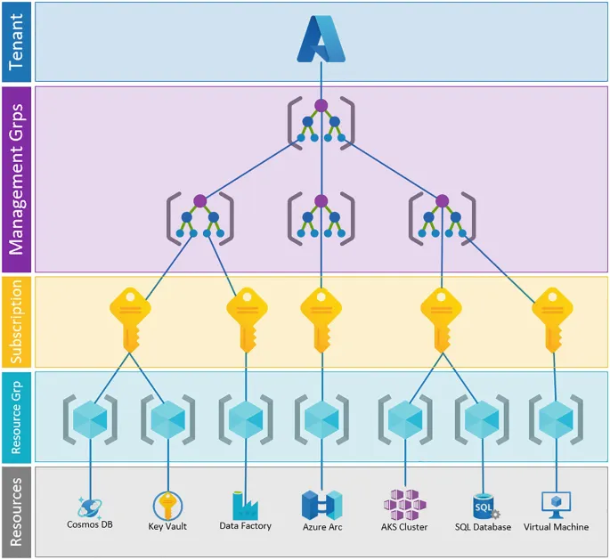

# Core Architectural Components of Microsoft Azure

## Physical infrastructure
> Datacenters : physical facilities housing resources in racks with dedicated power, cooling, networking infrastructure
> [global infrastructure](https://datacenters.microsoft.com/) 
>  [3D global map](https://datacenters.microsoft.com/globe/)
* Regions
    * geographical area containing 1+ datacenters networked together with low-latency network
    ```
    some services or virtual machine (VM) features are only available in certain regions, such as specific VM sizes or storage types. There are also some global Azure services that don't require you to select a particular region, such as Microsoft Entra ID, Azure Traffic Manager, and Azure DNS.
    ```

* Availbility Zones
    * physically seperate datacenters within an Azure region
    * 1+ dataacenters with independent powrer, cooling, netowrking
    * isolation boundary (if one datacenter goes down; other continues to function)
    * AZs connected through highspeed, private fiber-optic networks
    ```
    To ensure resiliency, a minimum of 3 AZs are present in all az-enabled regions; though not all regions support azs.
    ```
        * Primary Uses:
            * VMs, Managed disks, load balancers, SQL databases
            * Zonal Services - pin a resource to a specific zone (ie VMs, IPaddresses)
            * Zone Redundant services - replicating automatically across zones (redundant storage, databases)
            * Non-regional servies - for avaliability/resilency multi-regional/zonal deployment
* Region Pairs
    * Most azure regions are paired with another region within the same geography (ie US, Europe, Asia) at least 300 miles away.
        * west US <---> east US ; south-east asia <---> east asia
        * Most regions are paired in two directions, meaning they are the backup for the region that provides a backup for them ; though some exceptions (brazil; west india are one-direction pairing) 
    * allows for replication across a geopgrpahy to reduce interuptions due to natural disasters, civil unrest, power outage, physcial network outages.
    ``` 
    Not all azure services automatically replicate data or fall back from a failed region to a cross-replicate to another enabled region; recovery/replication shoudl be configured by the customer
    ```
    * if an extensive azure outage occurs, one region in a given pait is prioritixed to make sure one is restored ASAP
    * Planned azure updates are rolled out to paired regions one regoin at a time, minimizing downtime and risk of application outage
    * data continues to reside within same geography, tax/law enforcement jurisdiction can be maintained.
* Sovereign Regions
    * Instances of azure isolated from the main instance of azure (for compliance/legal purposes)
    * US DoD Central, Us Gov Virginia, US Gov Iowa... 
        * Physcial and netwok- isolated instances of Azure; operated by screens personal and have additional compliance certifications
    * China East, China North ...
        * special arrangements where microsoft does not maintain the datacenters.

## Azure Managemwnt Infrastructure
> Managament of Azure resources and resource groups, subscriptions, and accounts
    * Azure resources and resource groups
        * resource
            * A resource is the basic building block of azure
            * anything one creates, provisions, deployes, etc ( VMs, virtual networls, databases, cognitive services...)
        * resource group
            * grouping of resources
                * when a resource is created it must be placed in a resource group
                * a resource can move between resource groups, but only will associate with one group at a time
                * resource groups cannot be nested (Group B cannot be maintained under Group B)
            * Grouping alls a single action to a resource group to apply to all the resources within the group
                * if delete a resoure group, all resources will be deleted 
                * grant/deny access to a resource group, one grants/denies access to all resources within the resource group
    * Azure subscriptions
        * unit of management, billing, and scale
        * logically organize resources groups and facilitate billing
        * provides authentication and autorization
        * allows provisioning of resources
        * links to azure acccount (identity in Microsoft Entra ID or a directory that Microsoft Entra ID trusts)
        * one account can have 1+ subscriptions; multi-subscriptions allow for 
            * configuration of different billing models 
            * access management policies
            * define boundaries around products, services, resources
                * billing boundaryL how a azure account is billed for azure use - Azure generates separate billing reports and invoices for each subscription so that you can organize and manage cost
                * access control boundary - azure applies access-management policies at subscription level, user can create seperate subscriptions to reflect different organizational structures (departments)
                * environements (dev/test/prod)
                * deparment/organizational stuctures
                * billing
    * Azure Management groups 
        * Provide a level of scopr above subscriptions
        * User organizaes subscriptions into containers called management groups
        * apply governacne conditions to the management groups
            * all subscriptions within the management group inherit the conditios applied at the management group level
        * enterprise-grade management at a large scale regardless of the number of subscriptions you have
        * management groups CAN be nested
        ``` 
        Important facts about management groups:

        - 10,000 management groups can be supported in a single directory.
        - A management group tree can support up to six levels of depth. 
            - This limit doesn't include the root level or the subscription level.
        - Each management group and subscription can support only one parent.
        ```
    * Managment Groups -> Subscriptions -> Resource Groups -> Resources
        
