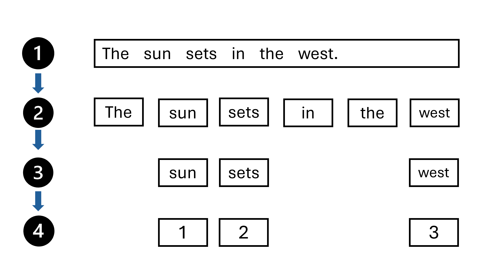
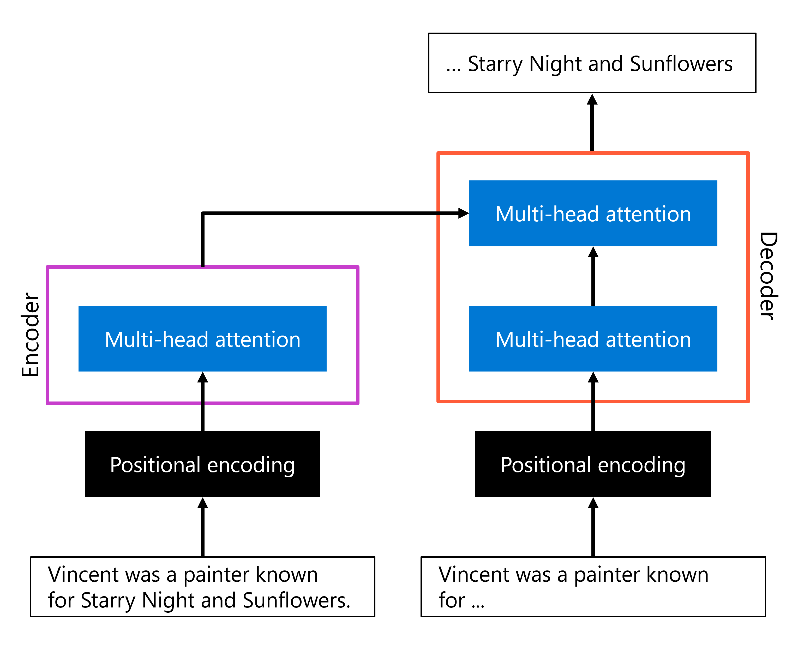

# Microsoft and Generative AI Fundamentals
> There's no wizardry involved in generative AI – just the application of mathematical techniques incrementally discovered and refined over many years of research into statistics, data science, and machine learning. 


* Artificial Intelligence (AI) 
    * imitating human behavior by using machine learning to interact with the environment and execute tasks wihtout explicit direction on what to output
* Generative AI 
    * Category of capabilities within AI creating original content
    * Like - taking in natural language input and returning responses in a variety of formats such as natural laguage, images, code... 
    * examples
        * Natural Language Generation 
            * Input " Write a cover letter for a person with a BA in history"
            * Response: ``` Dear hiring Manager ... ```
        * Image Generation
            * Input "Create a logo for a florist business"
            * Response  Image generation of flower... 
        * Code Generation 
            * Input "Write Python code to add two numbers"
            * Response 
                ```sh
                def add_number(a, b):
                    return a += b
                ```
* Language Models
    * How do they work?
        * Background
            * Natural Language Processing (NLP) 
            * Large Language Models (LLM)
            * The developement and availability of langugage models led to new ways to interact with applicatoins and sysrems - via GenAI assistents and agents
        * Developments of LLMs
            * Tokenization - enable machines to **read**
                * convert the presented texts to numbers
                * Tokens are strings with known meanings (usually representing a word)
                * Tokenization is the turning of words into tokens which are then converted to numbers
                * **Tokenizatoin allowed for text to be labeled - and thus statistical tecnques could be used to let computers find patterns in the data instead of applying data based models**
                    
                    * enter text you want to _tokenize_
                    * _split_ words in text based on rule (ie split on white space)
                    * _stop word removal_ remove noisy words that have little meaning (the, a - usually given via a dictionary)
                    * _assign a number_ to each unique token
            * Word embeddings - enable machines to **capture** relationship between words
                * Word embeddings address the problem of not being able to define semantic relationship between words
                * created via Deep learngin Model training process
                    * model analyzes the co-occurence patterns of words in sentences and learns to represent them as **vectors**
                        * vector : represents a path through a point in n-dimensional space (a line)
                    * semantic relationships are defined by how similar the angels of the lines are (the direction of the path); thus allowing the relationship to be described and calculated
                    * _contextual vectors_ embeddings - 
                        * multi-valued numeric representations of information, for example [10, 3, 1] in which each numeric element represents a particular attribute of the information. 
                        * For language tokens, each element of a token's vector represents some semantic attribute of the token. 
                            * The specific categories for the elements of the vectors in a language model are **determined during training based on how commonly words are used together or in similar contexts**
                        * So that semantically similar tokens should result in vectors that have a similar orientation – in other words they point in the same direction. (ie cat dog 10, buy skateboard -3)
                    
            * Architectural developments - chcanging design of LLMs enabled to capture **word content**
                * The structure and organization of the various components and processes of a machine learnign model, defining how data is processed and models trained/evaluated, and predictions generated
                * Recurrent Neural Networks (RNNs)
                    * can take in thto account the context of words through multiple sequential steps (since words can change meaning based on context presented in or around)
                    * each step takes an _input_ and a _hidden state_ then produces an _output_; the hidden state can serve as memory of the network soting output of the previous step...
                        * "Vincent Van Gogh was a painter most known for creating stunning and emotionally expressive artworks, including ..."
                            * To know what word comes next, you need to remember the name of the painter. 
                            * The sentence needs to be completed, as the last word is still missing. A missing or masked word in NLP tasks is often represented with [MASK]. 
                            * By using the special [MASK] token in a sentence, you can let a language model know it needs to predict what the missing token or value is.
                            * The RNN takes each token as an input, processes it, and updates the hidden state with a memory of that token. When the next token is processed as new input, the hidden state from the previous step is updated.
                            * Finally, the last token is presented as input to the model, namely the [MASK] token. Indicating that there's information missing and the model needs to predict its value. The RNN then uses the hidden state to predict that the output should be something like Starry Night
* Transformer architecture
    * The Encoder
        * processing the input and creating represenation that captures the content of each token
        * an input sequence is encoded with positional encoding, after which multi-head attention is used to create a representation of the text.
    * Decorder 
        * generates output sequence by attending to the encoder's represenation and predicting the next token in the sequence
        * decoder layer, an (incomplete) output sequence is encoded in a similar way, by first using positional encoding and then multi-head attention. Then, the multi-head attention mechanism is used a second time within the decoder to combine the output of the encoder and the output of the encoded output sequence that was passed as input to the decoder part. As a result, the output can be generated.
    * **The most important innovations presented in the Transformer architecture were positional encoding and multi-head attention. A simplified representation of the architecture:** 
        
        * Positional Encoding 
            * position of the word and order of the words are key!
            * encodes texts into vectors (not word embeddings like traditional LLMs)
            * the sum of word embedding vectors and positional vectors - thus encoding text in meaning and position
        * Attention (not recurrence)
            * rather than like RNNs (compute intensive), transformers don't process sequentially but each word in parallel using attention 
            * attention - mechanism used to map new information to learned information in order to understand what the new information entails
            * attention function - new word is encoded (with positional encoding) and represented as a query; the output is a _key_ with _value_
        * **The Transformer architecture has allowed us to train models in a more efficient way. Instead of processing each token in a sentence or sequence, attention allows a model to process tokens in parallel in various ways. Next, learn how different types of language models are available for generative AI.**

* Types of Language Models

| Large Language Models (LLMs) | Small Language Models (SLMs) |
| ------- | ----- |
| LLMs are trained with vast quantities of text that represent a wide range of general subject matter – typically by sourcing data from the Internet and other generally available publications. | SLMs are trained with smaller, more subject-focused datasets|
|When trained, LLMs have many billions (even trillions) of parameters (weights that can be applied to vector embeddings to calculate predicted token sequences). | Typically have fewer parameters than LLMs.|
|Able to exhibit comprehensive language generation capabilities in a wide range of conversational contexts.	| This focused vocabulary makes them effective in specific conversational topics, but less effective at more general language generation.|
| Their large size can impact their performance and make them difficult to deploy locally on devices and computers. |	The smaller size of SLMs can provide more options for deployment, including local deployment to devices and on-premises computer|
|Fine-tuning the model with more data to customize its subject expertise can be time-consuming, and expensive in terms of the compute power required to perform the extra training.	| Fine-tuning can potentially be less time-consuming and expensive.|

* 