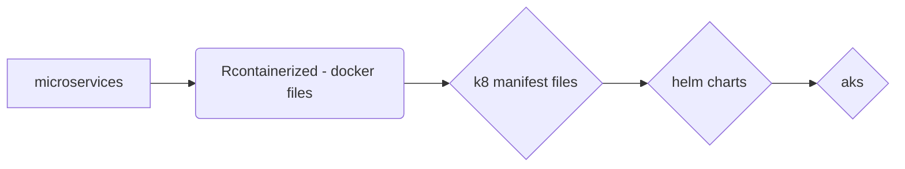

> example application demonstration with variable programming languages (node.js, python, java ....) and databases (mongoDb, mysql)
> ie, also demonstrates that each microservice should be able to act independently and isolated, managed and deployed 

# the components

8 microservices
* user microservice 
    * registration of users (validation, restriction on passwords etc)
    * log in 
    * accesses --> DataBase
* catalogue microservice
    * product 1 : 
        * a ...*
    * product 2 :
        * a ... *
    * ... 
    * accesses --> DataBase
* cart microservice
    * record and maintain cart through sessions
* shipping microservice
    * calcualting distance
    * price for shipping, taxes, location
* payment microservice
* dispatch microservice
* Web microservice
    * user interface, html
    * deployed (nginx, etc) hosting the site!
* ratings service - (in-memory datastore)
    * slightly different from other services
    * each rating is stored in a in memory/caching server datastore (ie redis)
        * why in-memory data store / caching server - dynamic, less latency
        * usually redis with be stateful and backed. up in peristent storage/persistent volume thus allowing new redis pods to access data when newly spun up

2 databases
* mongoDb
    * user registration
* mysql database
    * images for products

# deploying the project to AKS
* need AKS
* Dockerfiles...

* steps

