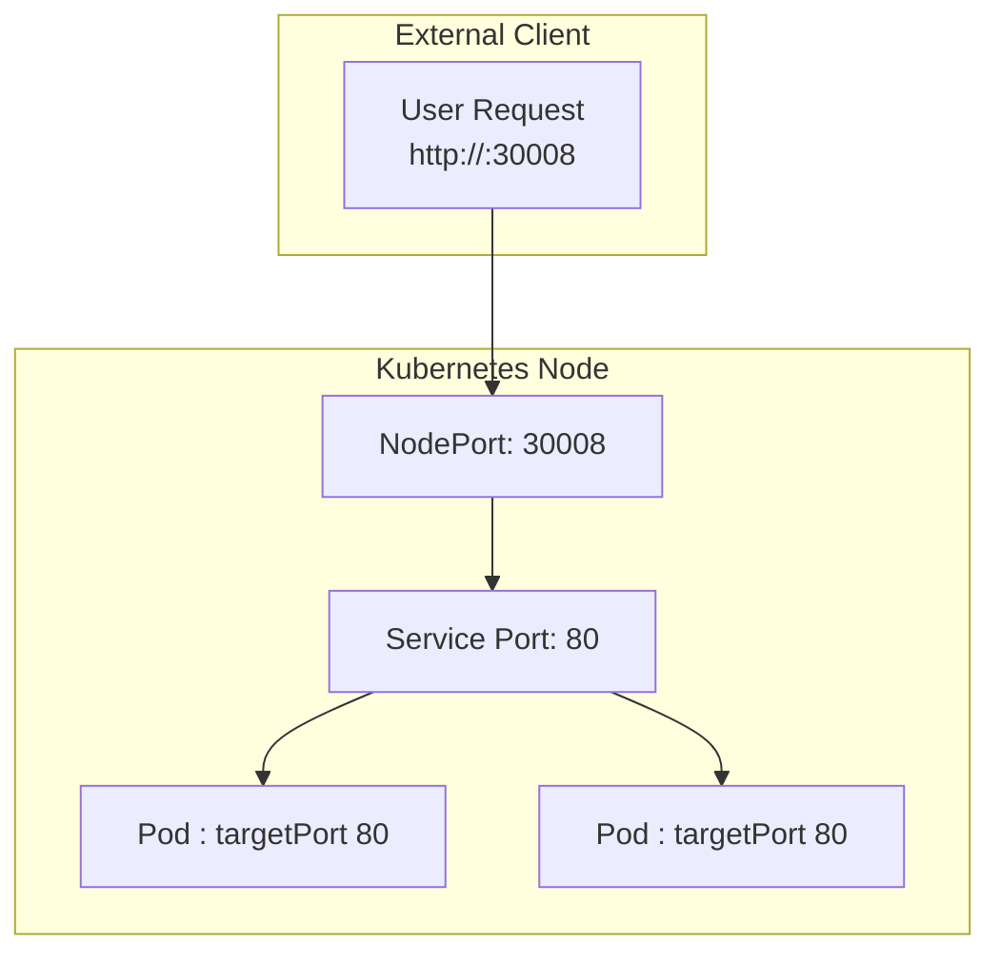
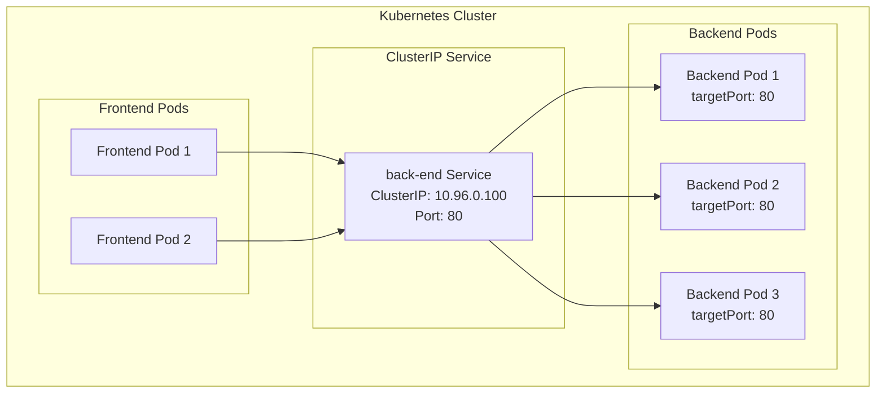
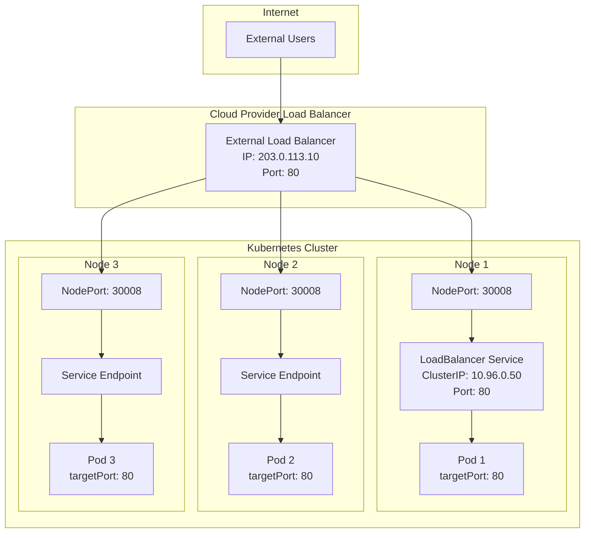

## Kubernetes Services.

> Kubernetes Services enable communication between components within and outside the app, connecting applications together with users and other applications

> That is if a application has groups of different pods (frontend, backend, db, external data) - Services enable connectivity between them 

| Type of service | Use |
| --- | --- |
| NodePort | Service makes an internal port accessible on a port on the node |
| ClusterIP | the service creates a virtual IP inside the cluster to enable communication between different services (frontend servers/backend ) |
| LoadBalancer | provisions a load balancer for our application in supported cloud providers |

## NodePort



*  maps a port on the node to a port on the nodes
*  for the service there are 3 ports involved:
    * _Target port_ on the POD iteself where the server is running (ie port 80 for a webserver)
        * where the service forwards the requests to
    * _The Port_ the port on the service itself.
        * the service is kind of like a virtual server it=nside the node
        * inside the cluster, it has its own IP address, the _clusetIP_ of the service
    * _the Node Port_ the port on the node irself
        * usws to access the web server externally

* you do need to refernce the pods!  Lables and selectors!  You can link mulitple pods to a single service, just use the right matching labels
    * say the Pods are distributed across multiple nodes. Kubernetes automatically creates a service that spans across all the nodes in the cluster and maps the target port to the same node port on all the nodes in the cluster.
    * In any case, whether it be a single Pod on a single node, multiple Pods on a single node or multiple Pods on multiple nodes, the service is created exactly the same

```pod.yaml
apiVersion: v1
kind: Pod
metadata:
    name: myapp-pod
    labels:
        app: myapp
        type: front-end
spec:
    containers:
    - name: nginx-container
      image: nginx
```


```service-definition.yaml
apiVersion: v1
kind: Service
metadata:
    name: myapp-service
spec:
    type: NodePort
    ports:
       - targetPort: 80
         port: 80
         nodePort: 30008
    selector: <!-- links service to the applicable pod -->
        app: myapp
        type: front-end  
```

```kubectl create -f service-definition.yaml```

## ClusterIP Service
> A typical full stack application is obviously made up of pods, usually of a various assortmnt, those running the front end (web) server, the backend, as well as perhaps a key:value store - redis  or a _persistent_ database like MySQL. But how do the serviees (tiers) communicate together - each has Ips, but they are not stable - the nature of pods - and the addresses are not stable.  Also how does a pod from the front end decide which pod of the back end it would be directed to ?




* The clusterIP service assigns a single IP address to the entire tier (the set of pods ) and manages each service / tier. allowing the seperate services to scale as needed without losing connectvity
* provides a stable internal virtual IP and DNS entry for accessing a set of Pods. It is the default and most common service type used for **communication inside the cluster**, enabling load balancing and decoupling services from pod IPs.
* by default this exposts the service **internally only- NO external access** by default
*  for the service there are 3 ports involved:
    * _Target port_ the port on the pods container where application is listening for incoming connections
        * the address of the applicaiton running inside the pod

    * _The Port_ the port  on which the _service_ itself is exposed within the cluster.
        * the address of the service pods within the same cluster communicate
        * When the Service receives traffic on the port, it then forwards that traffic to the targetPort of the selected Pod(s).

```service-definition.yaml
apiVersion: v1
kind: Service
metadata:
    name: back-end 
spec:
    type: ClusterIP
    ports:
       - targetPort: 80 
         port: 80
    selector: <!-- links service to the applicable pod -->
        app: myapp
        type: back-end  
```


## Load Balancer Service
> This service provides a way to expose your application externally. Provisioning an external load balancer. This gives an application inside the cluster (like a NodePort service) **stbale, publicIP address / DNS allowing external clients and users - those outside the cluster -  to communicaate directly ! Kubernetes essentially integrates with the load balancers of your typical cloud provider (like AWS / Azure); distributing traffics 




* The Load Balancer service acts and is set up very similarly to the Node port service - snd only works with supported cloud platforms ( like GCP,AWS, and Azure ) otherwise it will work just like a nodeport just without external load balancer configurations.


```service-definition.yaml
apiVersion: v1
kind: Service
metadata:
    name: myapp-service
spec:
    type: LoadBalancer
    ports:
       - targetPort: 80 
         port: 80
         nodePortL 3008

    selector: <!-- links service to the applicable pod -->
        app: myapp
        type: back-end  
```