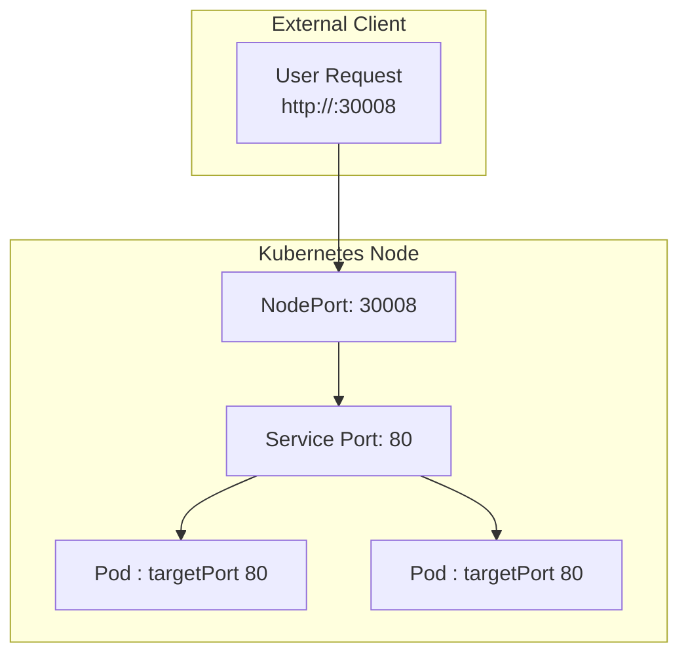

## Kubernetes Services.

> Kubernetes Services enable communication between components within and outside the app, connecting applications together with users and other applications

> That is if a application has groups of different pods (frontend, backend, db, external data) - Services enable connectivity between them 

| Type of service | Use |
| --- | --- |
| NodePort | Service makes an internal port accessible on a port on the node |
| ClusterIP | the service creates a virtual IP inside the cluster to enable communication between different services (frontend servers/backend ) |
| LoadBalancer | provisions a load balancer for our application in supported cloud providers |

## NodePort



*  maps a port on the node to a port on the nodes
*  for the service there are 3 ports involved:
    * _Target port_ on the POD iteself where the server is running (ie port 80 for a webserver)
        * where the service forwards the requests to
    * _The Port_ the port on the service itself.
        * the service is kind of like a virtual server it=nside the node
        * inside the cluster, it has its own IP address, the _clusetIP_ of the service
    * _the Node Port_ the port on the node irself
        * usws to access the web server externally

* you do need to refernce the pods!  Lables and selectors!  You can link mulitple pods to a single service, just use the right matching labels
    * say the Pods are distributed across multiple nodes. Kubernetes automatically creates a service that spans across all the nodes in the cluster and maps the target port to the same node port on all the nodes in the cluster.
    * In any case, whether it be a single Pod on a single node, multiple Pods on a single node or multiple Pods on multiple nodes, the service is created exactly the same

```pod.yaml
apiVersion: v1
kind: Pod
metadata:
    name: myapp-pod
    labels:
        app: myapp
        type: front-end
spec:
    containers:
    - name: nginx-container
      image: nginx
```


```service-definition.yaml
apiVersion: v1
kind: Service
metadata:
    name: myapp-service
spec:
    type: NodePort
    ports:
       - targetPort: 80
         port: 80
         nodePort: 30008
    selector: <!-- links service to the applicable pod -->
        app: myqpp
        type: front-end  
```

```kubectl create -f service-definition.yaml```